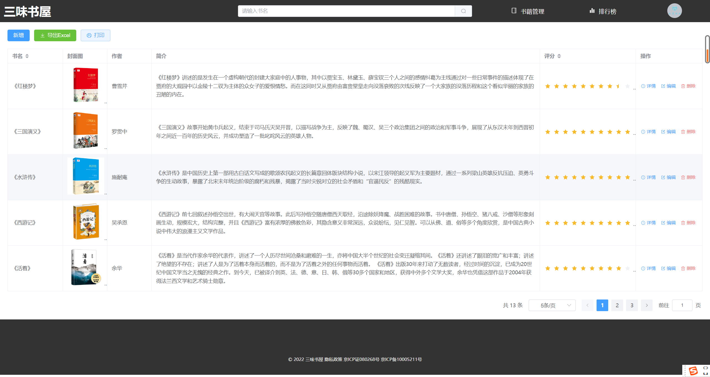
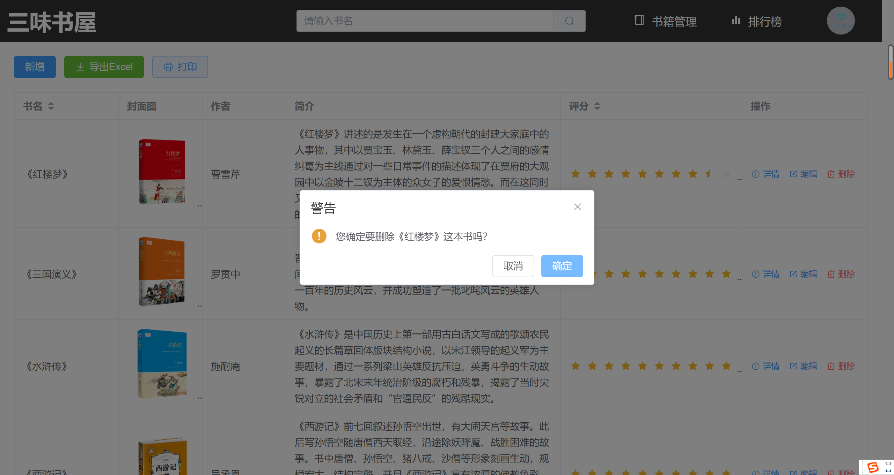

# 三味书屋
这是一个使用Vue3 + ElementPlus + json-server（服务器） + 第三方授权登录 + Echarts，开发的一个简单的图书管理小项目

## 功能列表
- 遵循OAuth 2.0协议，实现Github第三方授权登录
- 漂亮的登录页面
- 漂亮的排行榜
- 评分功能
- 添加书籍
- 修改书籍
- 删除书籍
- 模糊查询
- 分页
- 后端排序
- 导出为Excel
- 打印
- 个人中心
- 退出登录
- 简单的权限管理

> 注意：前端项目需使用 Live Server 插件运行，地址和端口号：http://127.0.0.1:5500/web/middle.html
因为Github授权的重定向页面为这个地址

## 服务器启动指令
```bash
npm run start
```

## 部分截图
|登录页面 |授权页面 |首页  |
|---|---|---|

|模糊查询 |书籍管理 |详情页  |
|---|---|---|

|新增 |编辑 |删除  |
|---|---|---|

|排行榜 |个人中心 |打印  |
|---|---|---|

